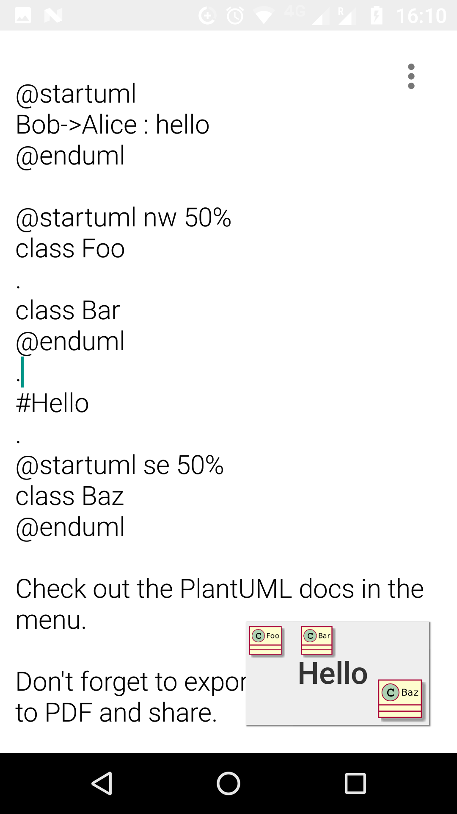

# PlantUML for Slide

## Summary

* Updated Gradle to 4.4, minSdkVersion 21, targetSdkVersion 27.
* Updated to use all the latest dependencies of Picasso, etc.
* Send PlantUML diagrams to a PlantUML server and render the generated
  image.
* Diagrams are rendered as normal Backgrounds.
* Which server is used can be configured.
* "Diagram preamble" can be configured, this allows one to put global
  settings for all diagrams. Some are really useful (transparent
  background and image resolution).
* *PlantUML is disabled by default, needs to be enabled in the overlay
  menu because of the confidentiality issues. Users should be aware
  that an external server is used and the diagram data is sent via
  internet.*
* Add the ability to start and end monospace text with a back tick
  "`" just like emphasis with "*".
