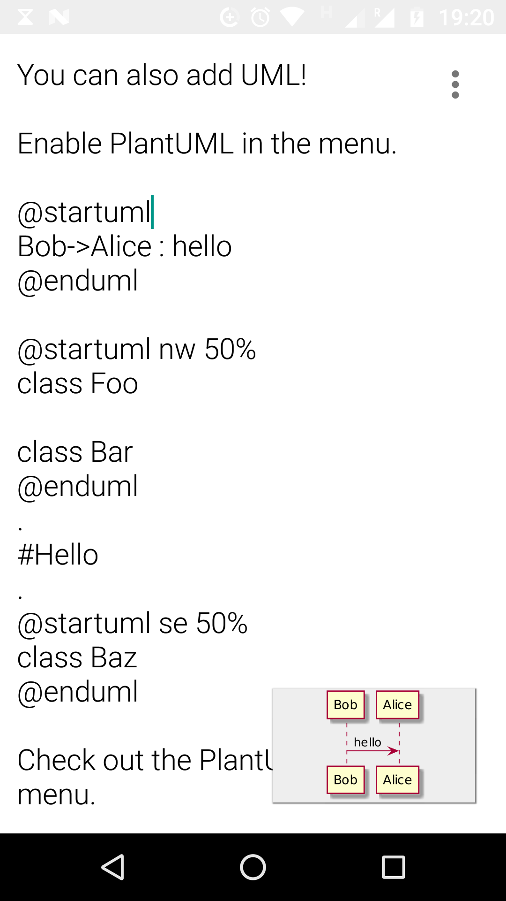
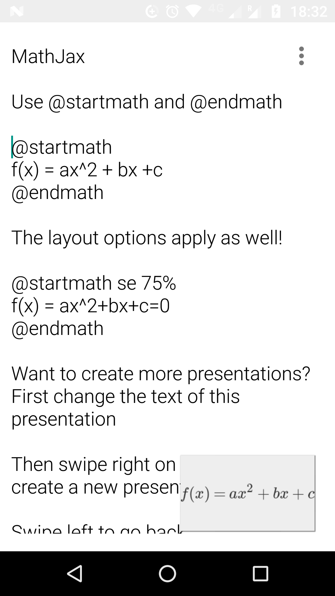

# PlantUML + MathJax + Other changes

## Summary

* minSdk 24 (CompletableFuture is too awesome)
* Updated to use all the latest dependencies of Picasso, etc.
* Send PlantUML diagrams to a PlantUML server and render the generated
  image.
* Diagrams are rendered as normal Backgrounds.
* Which server is used can be configured.
* "Diagram template" can be configured, this allows one to put global
  settings for all diagrams. Some are really useful (transparent
  background and image resolution).
* "Slide template" can be configured, this allows you to put text at
  the start or end of every slide.
* *PlantUML is disabled by default, needs to be enabled in the overlay
  menu because of the confidentiality issues. Users should be aware
  that an external server is used and the diagram data is sent via
  internet.*
* Allow input of mathematical formulas with MathJax.

## Other changes

* Add the ability to start and end monospace text with a back tick
  "`" just like emphasis with "*".
* When exporting to PDF, render the Slide to a Bitmap and then render
  that to PDF. This is uglier, but it allows you to use Emoji in your
  PDFs. :)
* Added the ability to select resolution when exporting PDF. You can
  export to 720p, 1080p, and 4K.
* Replaced general open/save document functionality with a
  "Presentation Deck". Simply swipe left or right to go to a
  previous/next presentation. 
* Add button to remove presentations.
* Added separate settings for each presentation.
* Added notification for PDF export.
* Preview now listens to swipe left/right. Close the preview by
  tapping on a slide.
* Added loading screens to make the app more responsive.
